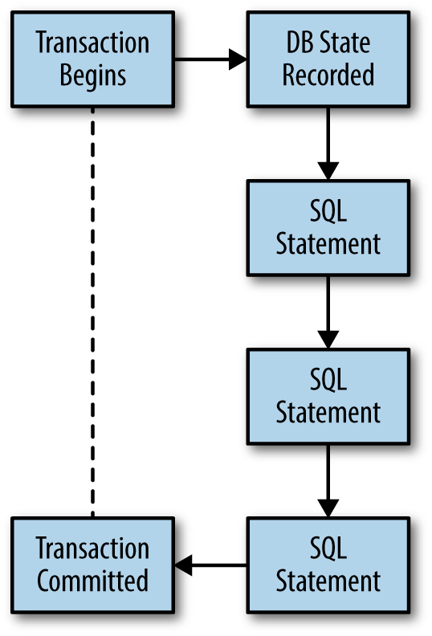
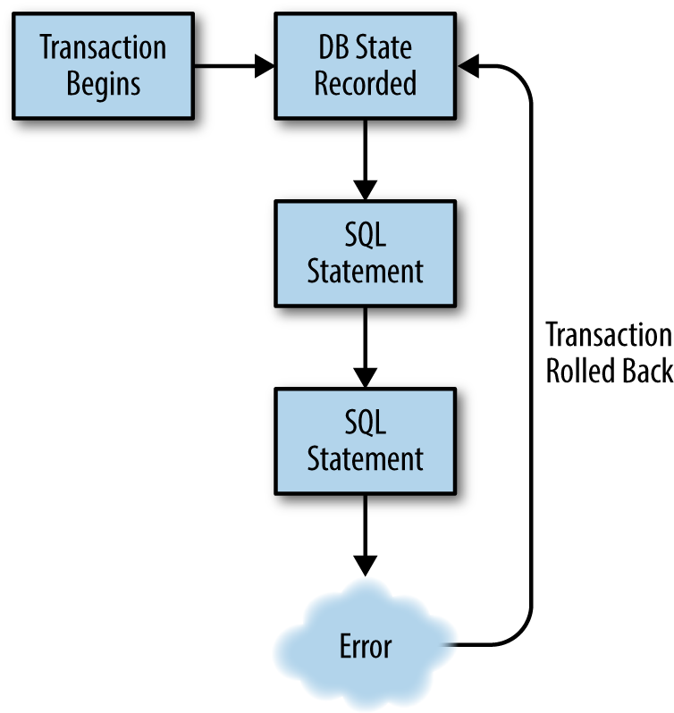

# Chapter 3. Exceptions and Transactions

In the previous chapter, we did a lot of work with data in single statements, and we avoided doing anything that could result in an error. In this chapter, we will purposely perform some actions incorrectly so that we can see the types of errors that occur and how we should respond to them. We’ll conclude the chapter by learning how to group statements that need to succeed together into transactions so that we can ensure that either the group executes properly or is cleaned up correctly. Let’s start by blowing things up!

## Exceptions

There are numerous exceptions that can occur in SQLAlchemy, but we’ll focus on the most common ones: AttributeErrors and IntegrityErrors. By learning how to handle these common exceptions, you’ll be better prepared to deal with the ones that occur less frequently.

To follow along with this chapter, make sure you start a new Python shell and load the tables that we built in Chapter 1 into your shell. Example 3-1 contains those tables and the connection again for reference.

```python
from datetime import datetime

from sqlalchemy import (MetaData, Table, Column, Integer, Numeric, String,
                        DateTime, ForeignKey, Boolean, create_engine,
                        CheckConstraint)
metadata = MetaData()

cookies = Table('cookies', metadata,
    Column('cookie_id', Integer(), primary_key=True),
    Column('cookie_name', String(50), index=True),
    Column('cookie_recipe_url', String(255)),
    Column('cookie_sku', String(55)),
    Column('quantity', Integer()),
    Column('unit_cost', Numeric(12, 2)),
    CheckConstraint('quantity > 0', name='quantity_positive')
)

users = Table('users', metadata,
    Column('user_id', Integer(), primary_key=True),
    Column('username', String(15), nullable=False, unique=True),
    Column('email_address', String(255), nullable=False),
    Column('phone', String(20), nullable=False),
    Column('password', String(25), nullable=False),
    Column('created_on', DateTime(), default=datetime.now),
    Column('updated_on', DateTime(), default=datetime.now, onupdate=datetime.now)
)

orders = Table('orders', metadata,
    Column('order_id', Integer()),
    Column('user_id', ForeignKey('users.user_id')),
    Column('shipped', Boolean(), default=False)
)

line_items = Table('line_items', metadata,
    Column('line_items_id', Integer(), primary_key=True),
    Column('order_id', ForeignKey('orders.order_id')),
    Column('cookie_id', ForeignKey('cookies.cookie_id')),
    Column('quantity', Integer()),
    Column('extended_cost', Numeric(12, 2))
)

engine = create_engine('sqlite:///:memory:')
metadata.create_all(engine)
connection = engine.connect()
```

The first error we are going to learn about is the AttributeError; this is the most commonly encountered error I see in code I’m debugging.

## AttributeError

We will start with an AttributeError that occurs when you attempt to access an attribute that doesn’t exist. This often occurs when you are attempting to access a column on a ResultProxy that isn’t present. AttributeErrors occur when you try to access an attribute of an object that isn’t present on that object. You’ve probably run into this in normal Python code. I’m singling it out because this is a common error in SQLAlchemy and it’s very easy to miss the reason why it is occuring. To demonstrate this error, let’s insert a record into our users table and run a query against it. Then we’ll try to access a column on that table that we didn’t select in the query (Example 3-2).

```python
from sqlalchemy import select, insert
ins = insert(users).values(
    username="cookiemon",
    email_address="mon@cookie.com",
    phone="111-111-1111",
    password="password"
)
result = connection.execute(ins) 1

s = select([users.c.username])
results = connection.execute(s)
for result in results:
    print(result.username)
    print(result.password) 2
```


1- Inserting a test record.
2- Password doesn’t exist, as we only queried the username column.

The code in Example 3-2 causes Python to throw an AttributeError and stops the execution of our program. Let’s look at the error output, and learn how to interpret what happened (Example 3-3).

```python
cookiemon

AttributeError                            Traceback (most recent call last) 1
<ipython-input-37-c4520631a10a> in <module>()
      3 for result in results:
      4     print(result.username)
----> 5     print(result.password) 2

AttributeError: Could not locate column in row for column 'password' 3
```


1- This shows us the type of error and that a traceback is present.
2- This is the actual line where the error occurred.
3- This is the interesting part we need to focus on.

In Example 3-3, we have the typical format for an AttributeError in Python. It starts with a line that indicates the type of error. Next, there is a traceback showing us where the error occurred. Because we tried to access the column in our code, it shows us the actual line that failed. The final block of lines is where the important details can be found. It again specifies the type of error, and right after it shows you why this occurred. In this case, it is because our row from the ResultProxy does not have a password column. We only queried for the username. While this is a common Python error that we can cause through a bug in our use of SQLAlchemy objects, there are also SQLAlchemy-specific errors that reference bugs we cause with SQLAlchemy statements themselves. Let’s look at one example: the IntegrityError.

## IntegrityError

Another common SQLAlchemy error is the IntegrityError, which occurs when we try to do something that would violate the constraints configured on a Column or Table. This type of error is commonly encountered in cases where you require something to be unique—for example, if you attempt to create two users with the same username, an IntegrityError will be thrown because usernames in our users table must be unique. Example 3-4 shows some code that will cause such an error.

```python
s = select([users.c.username])
connection.execute(s).fetchall() 1

[(u'cookiemon',)]

ins = insert(users).values(
    username="cookiemon",
    email_address="damon@cookie.com",
    phone="111-111-1111",
    password="password"
)
result = connection.execute(ins) 2
```


1- View the current records in the users table.
2- Attempt to insert the second record, which will result in the error.

The code in Example 3-4 causes SQLAlchemy to create an IntegrityError. Let’s look at the error output, and learn how to interpret what happened (Example 3-5).

```python
IntegrityError                            Traceback (most recent call last)
<ipython-input-7-6ecafb68a8ab> in <module>()
      5     password="password"
      6 )
----> 7 result = connection.execute(ins) 1

... 2

IntegrityError: (sqlite3.IntegrityError) UNIQUE constraint failed:
users.username [SQL: u'INSERT INTO users (username, email_address, phone,
password, created_on, updated_on) VALUES (?, ?, ?, ?, ?, ?)'] [parameters:
('cookiemon', 'damon@cookie.com', '111-111-1111', 'password',
'2015-04-26 10:52:24.275082', '2015-04-26 10:52:24.275099')] 3
```


1- this is the line that triggered the error.
2- There is a long traceback here that I omitted.
3- This is the interesting part we need to focus on.

Example 3-5 shows the typical format for an IntegrityError output in SQLAlchemy. It starts with the line that indicates the type of error. Next, it includes the traceback details. However, this is normally only our execute statement and internal SQLAlchemy code. Typically, the traceback can be ignored for the IntegrityError type. The final block of lines is where the important details are found. It again specifies the type of error, and tells you what caused it. In this case, it shows:

UNIQUE constraint failed: users.username

This points us to the fact that there is a unique constraint on the username column in the users table that we tried to violate. It then provides us with the details of the SQL statement and its compiled parameters similar to what we looked at in Chapter 2. The new data we tried to insert into the table was not inserted due to the error. This error also stops our program from executing.

While there are many other kinds of errors, the two we covered are the most common. The output for all the errors in SQLAlchemy will follow the same format as the two we just looked at. The SQLAlchemy documentation contains information on the other types of errors.

Because we don’t want our programs to crash whenever they encounter an error, we need to learn how to handle errors properly.

## Handling Errors

To prevent an error from crashing or stopping our program, errors need to be handled cleanly. We can do this just as we would for any Python error, with a try/except block. For example, we can use a try/except block to catch the error and print an error message, then carry on with the rest of our program; Example 3-6 shows the details.

```python
from sqlalchemy.exc import IntegrityError 1
ins = insert(users).values(
    username="cookiemon",
    email_address="damon@cookie.com",
    phone="111-111-1111",
    password="password"
)
try:
    result = connection.execute(ins)
except IntegrityError as error: 2
    print(error.orig.message, error.params)
```
1- All the SQLAlchemy exceptions are available in the sqlalchemy.exc module.
2- We catch the IntegrityError exception as error so we can access the properties of the exception.

In Example 3-6, we are running the same statement as Example 3-4, but wrapping the statement execution in a try/except block that catches an IntegrityError and prints a message with the error message and statement parameters. While this example demonstrated how to print an error message, we can write any Python code we like in the exception clause. This can be useful for returning an error message to application users to inform them that the operation failed. By handling the error with a try/except block, our application continues to execute and run.

While Example 3-6 shows an IntegrityError, this method of handling errors will work for any type of error generated by SQLAlchemy. For more information on other SQLAlchemy exceptions, see the SQLAlchemy documentation at http://docs.sqlalchemy.org/en/latest/core/exceptions.html.

  Remember it is best practice to wrap as little code as possible in a try/except block and only catch specific errors. This prevents catching unexpected errors that really should have a different behavior than the catch for the specific error you’re watching for.

While we were able to handle the exceptions from a single statement using traditional Python tools, that method alone won’t work if we have multiple database statements that are dependent on one another to be completely successful. In such cases, we need to wrap those statements in a database transaction, and SQLAlchemy provides a simple-to-use wrapper for that purpose built into the connection object: transactions.

## Transactions

Rather than learning the deep database theory behind transactions, just think of transactions as a way to ensure that multiple database statements succeed or fail as a group. When we start a transaction, we record the current state of our database; then we can execute multiple SQL statements. If all the SQL statements in the transaction succeed, the database continues on normally and we discard the prior database state. Figure 3-1 shows the normal transaction workflow.



However, if one or more of those statements fail, we can catch that error and use the prior state to roll back back any statements that succeeded. Figure 3-2 shows a transaction workflow in error.



There is already a good example of when we might want to do this in our existing database. After a customer has ordered cookies from us, we need to ship those cookies to the customer and remove them from our inventory. However, what if we do not have enough of the right cookies to fulfill an order? We will need to detect that and not ship that order. We can solve this with transactions.

We’ll need a fresh Python shell with the tables from Chapter 2; however, we need to add a CheckConstraint to the quantity column to ensure it cannot go below 0, because we can’t have negative cookies in inventory. Next, re-create the cookiemon user as well as the chocolate chip and dark chocolate chip cookie records. Set the quantity of chocolate chip cookies to 12 and the dark chocolate chip cookies to 1. Example 3-7 shows the full code for setting up the tables with the CheckConstraint, adding the cookiemon user, and adding the cookies.

```python
from datetime import datetime

from sqlalchemy import (MetaData, Table, Column, Integer, Numeric, String,
                        DateTime, ForeignKey, Boolean, create_engine,
                        CheckConstraint)
metadata = MetaData()

cookies = Table('cookies', metadata,
    Column('cookie_id', Integer(), primary_key=True),
    Column('cookie_name', String(50), index=True),
    Column('cookie_recipe_url', String(255)),
    Column('cookie_sku', String(55)),
    Column('quantity', Integer()),
    Column('unit_cost', Numeric(12, 2)),
    CheckConstraint('quantity >= 0', name='quantity_positive')
)

users = Table('users', metadata,
    Column('user_id', Integer(), primary_key=True),
    Column('username', String(15), nullable=False, unique=True),
    Column('email_address', String(255), nullable=False),
    Column('phone', String(20), nullable=False),
    Column('password', String(25), nullable=False),
    Column('created_on', DateTime(), default=datetime.now),
    Column('updated_on', DateTime(), default=datetime.now, onupdate=datetime.now)
)

orders = Table('orders', metadata,
    Column('order_id', Integer()),
    Column('user_id', ForeignKey('users.user_id')),
    Column('shipped', Boolean(), default=False)
)

line_items = Table('line_items', metadata,
    Column('line_items_id', Integer(), primary_key=True),
    Column('order_id', ForeignKey('orders.order_id')),
    Column('cookie_id', ForeignKey('cookies.cookie_id')),
    Column('quantity', Integer()),
    Column('extended_cost', Numeric(12, 2))
)

engine = create_engine('sqlite:///:memory:')
metadata.create_all(engine)
connection = engine.connect()
from sqlalchemy import select, insert, update
ins = insert(users).values(
    username="cookiemon",
    email_address="mon@cookie.com",
    phone="111-111-1111",
    password="password"
)
result = connection.execute(ins)
ins = cookies.insert()
inventory_list = [
    {
        'cookie_name': 'chocolate chip',
        'cookie_recipe_url': 'http://some.aweso.me/cookie/recipe.html',
        'cookie_sku': 'CC01',
        'quantity': '12',
        'unit_cost': '0.50'
    },
    {
        'cookie_name': 'dark chocolate chip',
        'cookie_recipe_url': 'http://some.aweso.me/cookie/recipe_dark.html',
        'cookie_sku': 'CC02',
        'quantity': '1',
        'unit_cost': '0.75'
    }
]
result = connection.execute(ins, inventory_list)
```

We’re now going to define two orders for the cookiemon user. The first order will be for nine chocolate chip cookies, and the second order will be for four chocolate chip cookies and one dark chocolate chip cookie. We’ll do this using the insert statements discussed in the previous chapter. Example 3-8 shows the details.

```python
ins = insert(orders).values(user_id=1, order_id='1')
result = connection.execute(ins)
ins = insert(line_items)
order_items = [
    {
        'order_id': 1,
        'cookie_id': 1,
        'quantity': 9,
        'extended_cost': 4.50
    }
]
result = connection.execute(ins, order_items) 1

ins = insert(orders).values(user_id=1, order_id='2')
result = connection.execute(ins)
ins = insert(line_items)
order_items = [
    {
        'order_id': 2,
        'cookie_id': 1,
        'quantity': 4,
        'extended_cost': 1.50
    },
    {
        'order_id': 2,
        'cookie_id': 2,
        'quantity': 1,
        'extended_cost': 4.50
    }
]
result = connection.execute(ins, order_items) 2
```

1- Adding the first order.
2- Adding the second order.

That will give us all the order data we need to explore how transactions work; now we need to define a function called ship_it. Our ship_it function will accept an order_id, remove the cookies from inventory, and mark the order as shipped. Example 3-9 shows how this works.

```python
def ship_it(order_id):

    s = select([line_items.c.cookie_id, line_items.c.quantity])
    s = s.where(line_items.c.order_id == order_id)
    cookies_to_ship = connection.execute(s)
    for cookie in cookies_to_ship: 1
        u = update(cookies).where(cookies.c.cookie_id==cookie.cookie_id)
        u = u.values(quantity = cookies.c.quantity - cookie.quantity)
        result = connection.execute(u)
    u = update(orders).where(orders.c.order_id == order_id)
    u = u.values(shipped=True)
    result = connection.execute(u) 2
    print("Shipped order ID: {}".format(order_id))
```
1- For each cookie type we find in the order, we remove the quantity ordered for it from the cookies table quantity so we know how many cookies we have left.
2- We update the order to mark it as shipped.

The ship_it function will perform all the actions required when we ship an order. Let’s run it on our first order and then query the cookies table to make sure it reduced the cookie count correctly. Example 3-10 shows how to do that.

```python
ship_it(1) 1
s = select([cookies.c.cookie_name, cookies.c.quantity])
connection.execute(s).fetchall() 2
```


1- Run ship_it on the first order_id.
2- Look at our cookie inventory.

Running the code in Example 3-10 results in:

```python
[(u'chocolate chip', 3), (u'dark chocolate chip', 1)]
```

Excellent! It worked. We can see that we don’t have enough cookies in our inventory to fulfill the second order; however, in our fast-paced warehouse, these orders might be processed at the same time. Now try shipping our second order with the ship_it function, and watch what happens (as shown in Example 3-11).

```python
ship_it(2)
```

That command gives us this result:

```python
IntegrityError                            Traceback (most recent call last)
<ipython-input-9-47771be6653b> in <module>()
----> 1 ship_it(2)

<ipython-input-6-301c0ed7c4a1> in ship_it(order_id)
      7         u = update(cookies).where(cookies.c.cookie_id ==
          cookie.cookie_id)
      8         u = u.values(quantity = cookies.c.quantity-cookie.quantity)
----> 9         result = connection.execute(u)
     10     u = update(orders).where(orders.c.order_id == order_id)
     11     u = u.values(shipped=True)

...

IntegrityError: (sqlite3.IntegrityError) CHECK constraint failed:
quantity_positive
[SQL: u'UPDATE cookies SET quantity=(cookies.quantity - ?) WHERE
cookies.cookie_id = ?'] [parameters: (4, 1)]
```

We got an IntegrityError because we didn’t have enough chocolate chip cookies to ship the order. However, let’s see what happened to our cookies table using the last two lines of Example 3-10:

```python
[(u'chocolate chip', 3), (u'dark chocolate chip', 0)]
```

It didn’t remove the chocolate chip cookies because of the IntegrityError, but it did remove the dark chocolate chip cookies. This isn’t good! We only want to ship whole orders to our customers. Using what you learned about try/except in “Handling Errors” earlier, you could devise a complicated except method that would revert the partial shipment. However, transactions provide us a better way to handle just this type of event.

Transactions are initiated by calling the begin() method on the connection object. The result of this call is a transaction object that we can use to control the result of all our statements. If all our statements are successful, we commit the transaction by calling the commit() method on the transaction object. If not, we call the rollback() method on that same object. Let’s rewrite the ship_it function to use a transaction to safely execute our statements; Example 3-12 shows what to do.

```python
from sqlalchemy.exc import IntegrityError 1
def ship_it(order_id):
    s = select([line_items.c.cookie_id, line_items.c.quantity])
    s = s.where(line_items.c.order_id == order_id)
    transaction = connection.begin() 2
    cookies_to_ship = connection.execute(s).fetchall() 3

    try:
        for cookie in cookies_to_ship:
            u = update(cookies).where(cookies.c.cookie_id == cookie.cookie_id)
            u = u.values(quantity = cookies.c.quantity-cookie.quantity)
            result = connection.execute(u)
        u = update(orders).where(orders.c.order_id == order_id)
        u = u.values(shipped=True)
        result = connection.execute(u)
        print("Shipped order ID: {}".format(order_id))
        transaction.commit() 4
    except IntegrityError as error:
        transaction.rollback() 5
        print(error)
```

1- Importing the IntegrityError so we can handle its exception.
2- Starting the transaction.
3- Fetching all the results just to make it easier to follow what is happening.
4- Commiting the transaction if no errors occur.
5- Rolling back the transaction if an error occurs.

Now let’s reset the dark chocolate chip cookies quantity back to 1:

```python
u = update(cookies).where(cookies.c.cookie_name == "dark chocolate chip")
u = u.values(quantity = 1)
result = connection.execute(u)
```

We need to rerun our transaction-based ship_it on the second order. The program doesn’t get stopped by the error, and prints us the error message without the traceback. Let’s check the inventory like we did in Example 3-10 to make sure that it didn’t mess up our inventory with a partial shipment:

```python
[(u'chocolate chip', 3), (u'dark chocolate chip', 1)]
```

Great! Our transactional function didn’t mess up our inventory or crash our application. We also didn’t have to do a lot of coding to manually roll back the statements that did succeed. As you can see, transactions can be really useful in situations like this, and can save you a lot of manual coding.

In this chapter, we saw how to handle exceptions in both single statements and groups of statements. By using a normal try/except block on a single statement, we can prevent our application from crashing in case a database statement error occurs. We also looked at how transactions can help us avoid inconsistent databases, and application crashes in groups of statements. In the next chapter, we’ll learn how to test our code to ensure it behaves the way we expect.